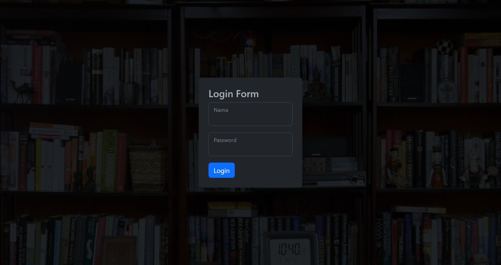
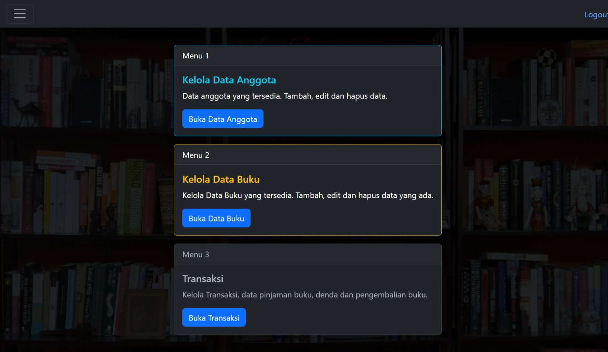
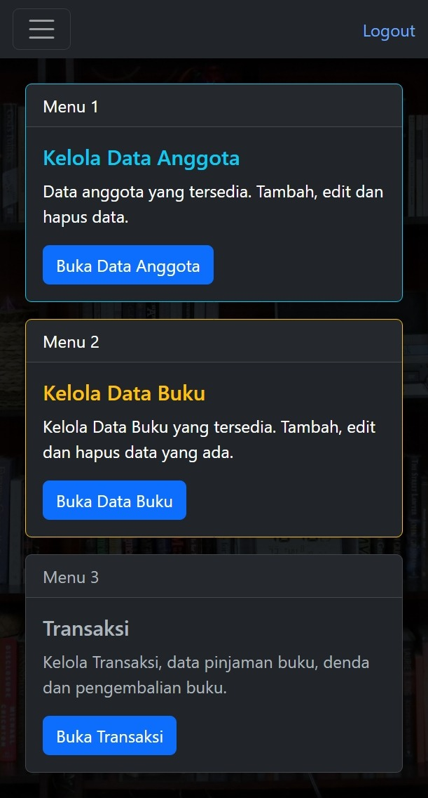

# Simplify-Perpus
Website Sistem Perpustakaan Simple dan Sederhana Dengan Native PHP, Repository ini merupakan Tugas-7 atau C-007 dari [Pelatihan VSGA-2023 dari Kominfo](https://github.com/Id-Yuu/id-vsga-jwd-b1). 

## Preview

| Desktop  | Mobile |
| ------------- | ------------- |
|  |  |

## Usage
- Clone this repo
```
git clone https://github.com/Id-Yuu/Simplify-Perpus.git
```
- Save to folder `htdocs` on folder `XAMPP`
- Run `Apache` and `Mysql` on XAMPP
- Open Browser and Open `localhost/phpmyadmin` and import the `sql`
- Run Project `localhost/Simplify-Perpus`

## Tech Stack
- VSCode
- Xampp v3.3.0 or latest version
- Mysql
- Bootstrap5 or latest version
- PHP 7.4 or latest version

## Disclaimer
Repository ini termasuk bagian dari;
- [Pelatihan VSGA](https://github.com/Id-Yuu/id-vsga-jwd-b1)
